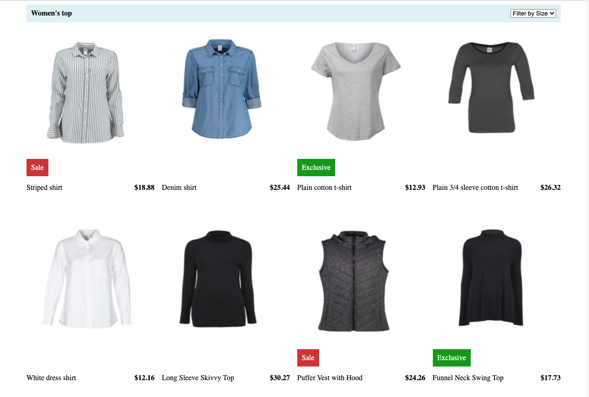

# Shopping Dashboard App

## About The Project
Create a shopping dashboard responsive web page using React framework that takes JSON API as input and display the products. Also, provide an dropdown option to filter the records based on Product Size.

### Requirements:
1. Build with React framework <br/>
2. Read data from JSON using https://rainy-star.surge.sh/products.json API <br/>
3. Responsive Layout <br/>
4. Build dropdown filters from data <br/>
5. Hide and show data depending on the dropdown filters <br/>

### Build With
• ReactJS

## Getting Started

### Prerequisites
• Install npm in local

### Installation
1. Clone the repo using SSH or HTTPS <br/>
    HTTPS: ``` git clone https://github.com/NaveenMN23/shopping.git ```
    SSH: ``` git clone git@github.com:NaveenMN23/shopping.git ```
2. Install NPM packages to install the NPM dependencies <br/>
    ``` npm install ```
3. Start the react app in development mode <br/>
    ``` npm start ```

## Screenshots




